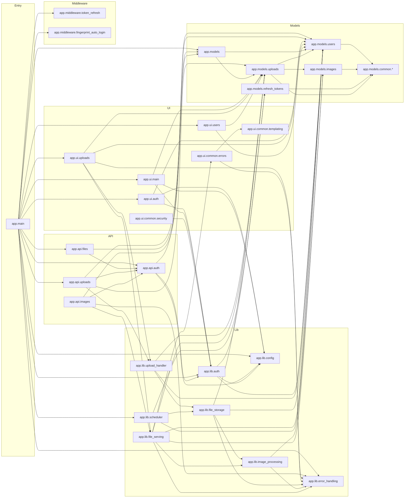

# Implementation Plan: Module Dependency and Layer Separation Refactor

## Overview

Refactor `app` module dependencies to enforce clean layer boundaries, remove circular dependencies, and eliminate cross-layer imports that make future maintenance difficult.

### Scope
- Map current module-to-module inclusion (`import` / `from ... import ...`) for `app/*`.
- Identify circular dependencies and layer violations.
- Define incremental refactor steps for a clean layered architecture.
- Preserve runtime behavior while improving import structure.

### Current State
- Internal module graph contains 47 Python modules and 120 internal dependency edges.
- One circular dependency exists between model modules.
- ~~One explicit cross-layer dependency exists from lib layer to UI layer.~~ *(resolved — Step 1 complete)*
- `app.main` currently orchestrates many modules directly, increasing coupling.

### Target State
- No circular dependencies across `app.*` modules.
- No imports from lower layers into upper layers (especially `lib -> ui`).
- Clear dependency direction by layer:
	- `main -> api/ui/middleware`
	- `api/ui/middleware -> lib/models`
	- `lib -> lib/models`
	- `models -> models/lib (non-UI)`
- Module graph remains acyclic and test suite remains green.

### Current Module Inclusion Map

### Confirmed Problem Areas
- Circular dependency: `app.models.uploads <-> app.models.users`.
- Layer violation: `app.lib.file_serving -> app.ui.common.errors`.
- High fan-out module: `app.main` (top orchestrator with many direct imports).

---

## Step 1: Break `lib -> ui` Dependency

**Files**:
- `app/lib/file_serving.py`
- `app/ui/common/errors.py`
- `app/ui/uploads.py`
- `app/api/files.py`
- `app/api/images.py`

**Tasks**:
1. [x] Remove `app.ui.common.errors` import from `app.lib.file_serving`.
2. [x] Make `app.lib.file_serving` raise typed exceptions only.
3. [x] Convert exceptions to UI/API responses at route/controller boundaries.

**Tests**
1. [x] Run `tests/test_integration_file_serving.py`.
2. [x] Run `tests/test_api_files.py`.
3. [x] Run `/get` fallback tests for error-image behavior.

**Acceptance Criteria**:
- [x] No `lib -> ui` imports remain.
- [x] File serving behavior and status codes remain unchanged.
- [x] Targeted tests pass.

**Implementation Notes**:
- Exceptions are now handled by global `@app.exception_handler` registrations in `app/main.py`, routing to JSON, image-error, or HTML responses based on request path.
- `error_template_response()` updated to accept an optional `title` parameter and pass both `empty_content_*` and `error_messages` context shapes simultaneously.
- `ui/uploads.py` local `try/except` blocks removed; `api/images.py` local `try/except` blocks removed.

---

## Step 2: Remove `models.users <-> models.uploads` Cycle

**Files**:
- `app/models/users.py`
- `app/models/uploads.py`
- `app/models/images.py`
- `app/models/__init__.py`

**Tasks**:
1. [ ] Replace runtime cross-imports with type-check-only imports where possible.
2. [ ] Move serializer coupling to a neutral module if runtime imports still required.
3. [ ] Ensure reverse relation typing does not require runtime circular imports.

**Tests**
1. [ ] Run `tests/test_models_users.py`.
2. [ ] Run `tests/test_models_uploads.py`.
3. [ ] Run serializer-related integration tests.

**Acceptance Criteria**:
- [ ] No module cycle between `app.models.users` and `app.models.uploads`.
- [ ] ORM and serializer behavior remains unchanged.
- [ ] Targeted tests pass.

---

## Step 3: Define and Enforce Layer Rules

**Files**:
- `docs/planning/implement-inheritance-refactor.md`
- `tests/` (new dependency-graph check test if appropriate)

**Tasks**:
1. [ ] Document allowed dependency directions between layers.
2. [ ] Add a lightweight import-graph check (AST-based) to detect new cycles/violations.
3. [ ] Fail CI/tests when forbidden edges are introduced.

**Tests**
1. [ ] Run new module-graph validation test.
2. [ ] Run full test suite.

**Acceptance Criteria**:
- [ ] Layer rules are documented in-repo.
- [ ] Automated guard exists for circular and forbidden layer imports.
- [ ] Full suite passes.

---

## Step 4: Reduce Main Orchestration Fan-out

**Files**:
- `app/main.py`
- `app/api/__init__.py`
- `app/ui/__init__.py`

**Tasks**:
1. [ ] Keep `app.main` as composition root only.
2. [ ] Route most imports through package-level registration modules.
3. [ ] Avoid direct imports in `app.main` that can be delegated.

**Tests**
1. [ ] Run startup and router registration tests.
2. [ ] Run auth middleware integration tests.

**Acceptance Criteria**:
- [ ] `app.main` has reduced direct dependency count.
- [ ] App startup and routing behavior are unchanged.
- [ ] Targeted tests pass.

---

## Step 5: Verify Target Architecture

**Files**:
- `docs/planning/implement-inheritance-refactor.md`

**Tasks**:
1. [ ] Re-run module graph extraction after refactor.
2. [ ] Update current-state and target-state summary with measured results.
3. [ ] Mark completed tasks and acceptance criteria.

**Tests**
1. [ ] Full test suite.

**Acceptance Criteria**:
- [ ] Module graph has no cycles.
- [ ] No cross-layer violations (`lib -> ui`, `models -> ui/api`, `api -> ui`).
- [ ] Refactor documented with before/after metrics.
